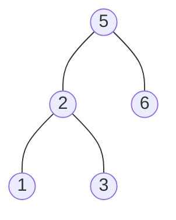

### [题目](https://leetcode.cn/problems/er-cha-sou-suo-shu-de-hou-xu-bian-li-xu-lie-lcof/){:target="_blank"}

输入一个整数数组，判断该数组是不是某二叉搜索树的后序遍历结果。如果是则返回true，否则返回false。
假设输入的数组的任意两个数字都互不相同。

参考以下这颗二叉搜索树：




示例 1：  
输入: [1,6,3,2,5]  
输出: false

示例 2：  
输入: [1,3,2,6,5]  
输出: true


提示：  
数组长度 <= 1000

### 题解

```java
public boolean verifyPostorder(int[] postorder) {
    int len = postorder.length;
    if (len <= 2) {
        return true;
    }

    BiFunction<Integer, Integer, Boolean> recursion = new BiFunction<Integer, Integer, Boolean>() {
        @Override
        public Boolean apply(Integer from, Integer end) {
            if (from >= end) {
                return true;
            }

            int left = from;
            // 左树都是小于根节点的值
            while (postorder[left] < postorder[end] && left < end) {
                left++;
            }

            // 右树必须都大于根节点值
            for (int i = left; i < end; i++) {
                if (postorder[i] < postorder[end]) {
                    return false;
                }
            }

            // 继续判断左右树均为二叉搜索树
            return this.apply(from, left - 1) && this.apply(left, end - 1);
        }
    };

    return recursion.apply(0, len - 1);
}
```