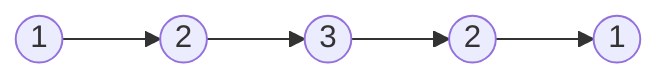
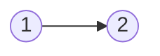

### [题目](https://leetcode.cn/problems/aMhZSa/){:target="_blank"}

给定一个链表的 头节点head，请判断其是否为回文链表。

如果一个链表是回文，那么链表节点序列从前往后看和从后往前看是相同的。


**示例 1：**



输入: head = [1,2,3,3,2,1]  
输出: true

**示例 2：**



输入: head = [1,2]  
输出: false

**提示：**
- 链表 L 的长度范围为 [1, 10<sup>5</sup>]
- 0<= node.val <= 9

**进阶：**能否用O(n) 时间复杂度和 O(1) 空间复杂度解决此题？

**注意：**本题与主站[234题](https://leetcode.cn/problems/palindrome-linked-list/){:target="_blank"}相同

### 题解

```java
public boolean isPalindrome(ListNode head) {
    // 快慢指针找中间节点
    ListNode slow = new ListNode(0, head), fast = slow;
    while (fast != null && fast.next != null) {
        slow = slow.next;
        fast = fast.next.next;
    }

    // 中间节点链表
    ListNode mid = slow.next;
    slow.next = null;
    // 链表倒置
    ListNode right = new ListNode(0), t;
    while (mid != null) {
        t = mid.next;
        mid.next = right.next;
        right.next = mid;
        mid = t;
    }

    // 判断是否回文
    right = right.next;
    while (right != null) {
        if (right.val != head.val) {
            return false;
        }

        right = right.next;
        head = head.next;
    }

    return true;
}
```