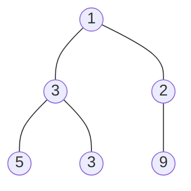
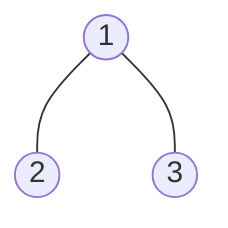
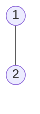

### [题目](https://leetcode.cn/problems/hPov7L/){:target="_blank"}

给定一棵二叉树的根节点root ，请找出该二叉树中每一层的最大值。

**示例1：**  
输入: root = [1,3,2,5,3,null,9]  
输出: [1,3,9]  
解释:



**示例2：**  
输入: root = [1,2,3]  
输出: [1,3]  
解释:



**示例3：**  
输入: root = [1]  
输出: [1]

**示例4：**  
输入: root = [1,null,2]  
输出: [1,2]  
解释:



**示例5：**  
输入: root = []  
输出: []

**提示：**
- 二叉树的节点个数的范围是 [0,10<sup>4</sup>]
- -2<sup>31</sup> <= Node.val <= 2<sup>31</sup> - 1

**注意：**本题与主站[515题](https://leetcode.cn/problems/find-largest-value-in-each-tree-row/){:target="_blank"}相同

### 题解

```java
public List<Integer> largestValues(TreeNode root) {
    List<Integer> result = new ArrayList<>();

    Queue<TreeNode> queue = new ArrayDeque<>();
    // 若根节点非空 则入队
    if (Objects.nonNull(root)) {
        queue.offer(root);
    }

    int max, size;
    TreeNode t;
    while (!queue.isEmpty()) {
        max = Integer.MIN_VALUE;
        size = queue.size();

        // 按照当前队列大小遍历
        for (int i = 0; i < size; i++) {
            t = queue.poll();
            // 迭代最大值
            max = Integer.max(t.val, max);

            // 左右树非空则入队
            if (Objects.nonNull(t.left)) {
                queue.offer(t.left);
            }
            if (Objects.nonNull(t.right)) {
                queue.offer(t.right);
            }
        }

        result.add(max);
    }


    return result;
}
```