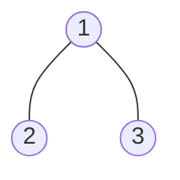
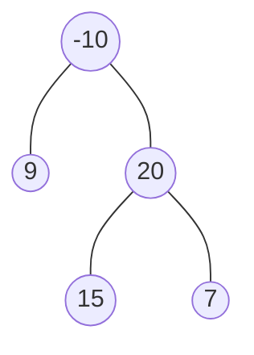

### [题目](https://leetcode.cn/problems/jC7MId/){:target="_blank"}

**路径**被定义为一条从树中任意节点出发，沿父节点-子节点连接，达到任意节点的序列。同一个节点在一条路径序列中**至多出现一次**。
该路径**至少包含一个**节点，且不一定经过根节点。

**路径和**是路径中各节点值的总和。

给定一个二叉树的根节点`root`，返回其**最大路径和**，即所有路径上节点值之和的最大值。


**示例 1：**



输入：root = [1,2,3]  
输出：6  
解释：最优路径是 2 -> 1 -> 3 ，路径和为 2 + 1 + 3 = 6

**示例 2：**



输入：root = [-10,9,20,null,null,15,7]  
输出：42  
解释：最优路径是 15 -> 20 -> 7 ，路径和为 15 + 20 + 7 = 42

**提示：**
- 树中节点数目范围是 [1, 3 * 10<sup>4</sup>]
- -1000 <= Node.val <= 1000

**注意：**本题与主站[124题](https://leetcode.cn/problems/binary-tree-maximum-path-sum/){:target="_blank"}相同

### 题解

```java
// 待完成
```