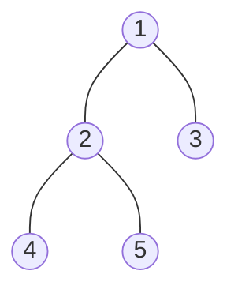

### [题目](https://leetcode-cn.com/problems/tree-node/){:target="_blank"}

给定一个表tree，id 是树节点的编号，p_id是它父节点的id 。

| id | p_id |
|:---|:---|
| 1  | null |
| 2  | 1    |
| 3  | 1    |
| 4  | 2    |
| 5  | 2    |

树中每个节点属于以下三种类型之一：

叶子：如果这个节点没有任何孩子节点。
根：如果这个节点是整棵树的根，即没有父节点。
内部节点：如果这个节点既不是叶子节点也不是根节点。


写一个查询语句，输出所有节点的编号和节点的类型，并将结果按照节点编号排序。上面样例的结果为：

| id | Type |
|:---|:---|
| 1  | Root |
| 2  | Inner|
| 3  | Leaf |
| 4  | Leaf |
| 5  | Leaf |


解释

节点 '1' 是根节点，因为它的父节点是 NULL ，同时它有孩子节点 '2' 和 '3' 。
节点 '2' 是内部节点，因为它有父节点 '1' ，也有孩子节点 '4' 和 '5' 。
节点 '3', '4' 和 '5' 都是叶子节点，因为它们都有父节点同时没有孩子节点。
样例中树的形态如下：




### 题解

```sql
-- 解1 效率相对较低
SELECT `t`.`id`,
       CASE
           WHEN `t`.`p_id` IS NULL
               THEN 'Root'
           WHEN EXISTS(SELECT 1 FROM `tree` WHERE `p_id` = `t`.`id`)
               THEN 'Inner'
           ELSE 'Leaf'
       END AS `Type`
FROM `tree` `t`;

-- 解2
SELECT `t`.`id`,
       CASE
           WHEN `t`.`p_id` IS NULL
               THEN 'Root'
           WHEN `s`.`cnt` > 0
               THEN 'Inner'
           ELSE 'Leaf'
       END AS `Type`
FROM `tree` `t`
         LEFT JOIN(
    SELECT `p_id` AS `id`, COUNT(1) AS `cnt`
    FROM `tree`
    GROUP BY `p_id`
) `s` ON `t`.`id` = `s`.`id`
```