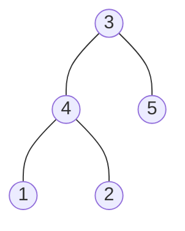
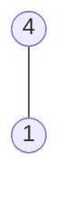

### [题目](https://leetcode-cn.com/problems/shu-de-zi-jie-gou-lcof/){:target="_blank"}

输入两棵二叉树A和B，判断B是不是A的子结构。(约定空树不是任意一个树的子结构)

B是A的子结构， 即 A中有出现和B相同的结构和节点值。

例如:
给定的树 A:



给定的树 B：



返回 true，因为 B 与 A 的一个子树拥有相同的结构和节点值。

示例 1：  
输入：A = [1,2,3], B = [3,1]  
输出：false

示例 2：  
输入：A = [3,4,5,1,2], B = [4,1]  
输出：true

限制：  
0 <= 节点个数 <= 10000

### 题解

```java
public boolean isSubStructure(TreeNode A, TreeNode B) {
    // 空树不是任何树的子树
    if (A == null || B == null) {
        return false;
    }

    BiFunction<TreeNode, TreeNode, Boolean> recursion = new BiFunction<TreeNode, TreeNode, Boolean>() {
        @Override
        public Boolean apply(TreeNode a, TreeNode b) {
            // 子树已经比较完成
            if (b == null) {
                return true;
            }

            if (a == null) {
                return false;
            }

            // 比较节点值是否一致以及左右树节点是否一致
            return a.val == b.val && this.apply(a.left, b.left) && this.apply(a.right, b.right);
        }
    };

    // 若值不一致 在A左树或右树上查找
    return recursion.apply(A, B) || this.isSubStructure(A.left, B) || this.isSubStructure(A.right, B);
}
```