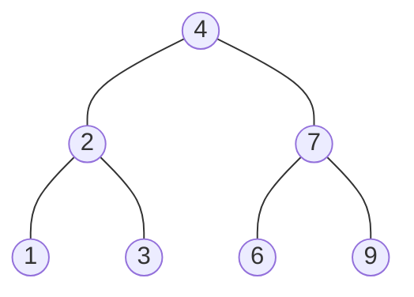
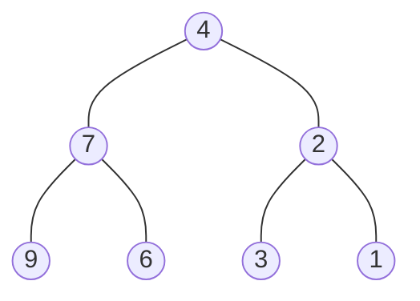

### [题目](https://leetcode-cn.com/problems/er-cha-shu-de-jing-xiang-lcof/){:target="_blank"}

请完成一个函数，输入一个二叉树，该函数输出它的镜像。

例如输入：



镜像输出：



示例 1：  
输入：root = [4,2,7,1,3,6,9]  
输出：[4,7,2,9,6,3,1]


限制：  
0 <= 节点个数 <= 1000

注意：本题与主站[226题](https://leetcode-cn.com/problems/invert-binary-tree/){:target="_blank"}相同

### 题解

```java
public TreeNode mirrorTree(TreeNode root) {
    if (root == null) {
        return null;
    }

    TreeNode mirror = new TreeNode(root.val);
    mirror.right = this.mirrorTree(root.left);
    mirror.left = this.mirrorTree(root.right);

    return mirror;
}
```