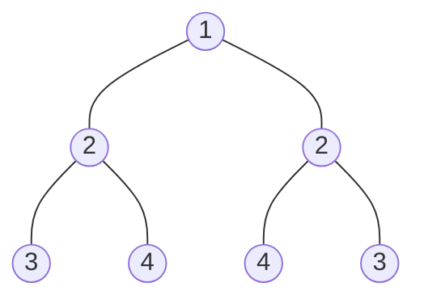
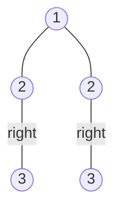

### [题目](https://leetcode-cn.com/problems/er-cha-shu-de-jing-xiang-lcof/){:target="_blank"}

请实现一个函数，用来判断一棵二叉树是不是对称的。如果一棵二叉树和它的镜像一样，那么它是对称的。

例如，二叉树[1,2,2,3,4,4,3] 是对称的。



但是下面这个[1,2,2,null,3,null,3] 则不是镜像对称的:




示例 1：  
输入：root = [1,2,2,3,4,4,3]  
输出：true

示例 2：  
输入：root = [1,2,2,null,3,null,3]  
输出：false

限制：  
0 <= 节点个数 <= 1000

注意：本题与主站[101题](https://leetcode-cn.com/problems/symmetric-tree/){:target="_blank"}相同

### 题解

```java
public TreeNode mirrorTree(TreeNode root) {
    if (root == null) {
        return null;
    }

    TreeNode mirror = new TreeNode(root.val);
    mirror.right = this.mirrorTree(root.left);
    mirror.left = this.mirrorTree(root.right);

    return mirror;
}
```