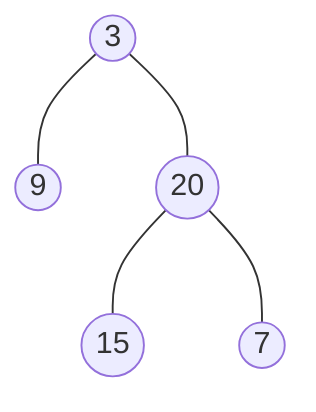

### [题目](https://leetcode-cn.com/problems/cong-shang-dao-xia-da-yin-er-cha-shu-lcof/){:target="_blank"}

从上到下打印出二叉树的每个节点，同一层的节点按照从左到右的顺序打印。

例如:
给定二叉树:[3,9,20,null,null,15,7]



返回：  
[3,9,20,15,7]


提示：  
节点总数 <= 1000

### 题解

```java
public int[] levelOrder(TreeNode root) {
    if (root == null) {
        return new int[0];
    }

    List<Integer> result = new ArrayList<>();
    // 队列添加根节点
    Queue<TreeNode> queue = new ArrayDeque<>(Collections.singletonList(root));

    while (!queue.isEmpty()) {
        TreeNode node = queue.poll();
        result.add(node.val);

        // 由左至右 先添加左节点 在添加右节点
        if (node.left != null) {
            queue.offer(node.left);
        }
        if (node.right != null) {
            queue.offer(node.right);
        }
    }

    return result.stream().mapToInt(Integer::intValue).toArray();
}
```