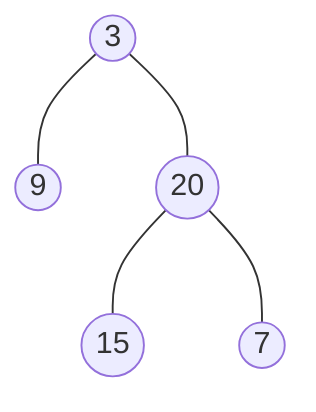

### [题目](https://leetcode-cn.com/problems/cong-shang-dao-xia-da-yin-er-cha-shu-ii-lcof/){:target="_blank"}

从上到下按层打印二叉树，同一层的节点按从左到右的顺序打印，每一层打印到一行。

例如:
给定二叉树:[3,9,20,null,null,15,7]


返回其层次遍历结果：

```java
[
  [3],
  [9, 20],
  [15, 7]
]
```


提示：  
节点总数 <= 1000

注意：本题与主站[102题](https://leetcode-cn.com/problems/binary-tree-level-order-traversal/){:target="_blank"}相同

### 题解

```java
public List<List<Integer>> levelOrder(TreeNode root) {
    List<List<Integer>> result = new ArrayList<>();
    Queue<TreeNode> queue = new ArrayDeque<>();
    Optional.ofNullable(root).ifPresent(queue::add);

    while (!queue.isEmpty()) {
        List<Integer> level = new ArrayList<>();
        // 队列中为上一层的数字 遍历开始前记录总数
        for (int i = queue.size(); i > 0; i--) {
            TreeNode node = queue.poll();
            level.add(node.val);
            if (node.left != null) {
                queue.add(node.left);
            }

            if (node.right != null) {
                queue.add(node.right);
            }
        }

        result.add(level);
    }

    return result;
}
```