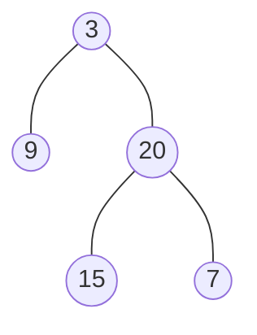

### [题目](https://leetcode-cn.com/problems/cong-shang-dao-xia-da-yin-er-cha-shu-iii-lcof/){:target="_blank"}

请实现一个函数按照之字形顺序打印二叉树，即第一行按照从左到右的顺序打印，第二层按照从右到左的顺序打印，
第三行再按照从左到右的顺序打印，其他行以此类推。

例如:
给定二叉树:[3,9,20,null,null,15,7]


返回其层次遍历结果：

```java
[
  [3],
  [20,9],
  [15,7]
]
```


提示：  
节点总数 <= 1000

### 题解

```java
public List<List<Integer>> levelOrder(TreeNode root) {
    if (root == null) {
        return new ArrayList<>();
    }

    // 初始化第一层
    Queue<TreeNode> queue = new ArrayDeque<>(Collections.singletonList(root));
    // 是否是奇数层级
    boolean isOdd = true;
    List<List<Integer>> result = new ArrayList<>();

    while (!queue.isEmpty()) {
        int len = queue.size();
        // 层级数字 奇数层按照顺序添加 偶数层倒叙添加
        // 使用链表 根据层数的奇偶性添加头或尾
        LinkedList<Integer> list = new LinkedList<>();
        for (int i = len; i > 0; i--) {
            TreeNode node = queue.poll();
            // 根据层数奇偶性判断添加在头还是尾
            if (isOdd) {
                list.add(node.val);
            } else {
                list.addFirst(node.val);
            }

            // 层序保证由左至右
            if (node.left != null) {
                queue.offer(node.left);
            }
            if (node.right != null) {
                queue.offer(node.right);
            }
        }
        result.add(list);
        // 奇偶层级切换
        isOdd = !isOdd;
    }

    return result;
}
```