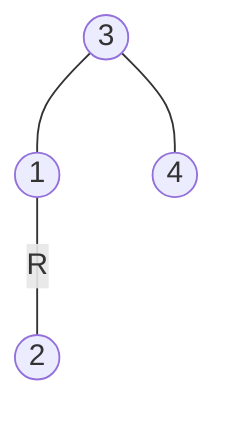
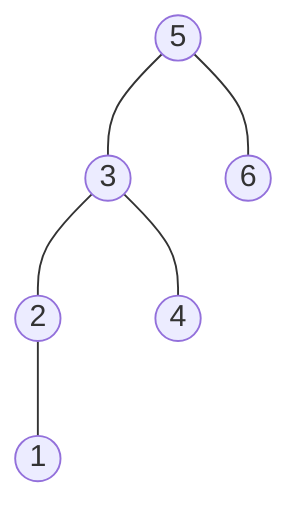

### [题目](https://leetcode-cn.com/problems/er-cha-sou-suo-shu-de-di-kda-jie-dian-lcof/){:target="_blank"}

给定一棵二叉搜索树，请找出其中第k大的节点。

示例 1:  
输入: root = [3,1,4,null,2], k = 1  



输出: 4

示例 2:  
输入: root = [5,3,6,2,4,null,null,1], k = 3  


输出: 4


限制：  
1 ≤ k ≤ 二叉搜索树元素个数

### 题解

```java
public int kthLargest(TreeNode root, int k) {
    List<Integer> nums = new ArrayList<>();
    // 中序遍历树
    Consumer<TreeNode> inorderTraversal = new Consumer<TreeNode>() {
        @Override
        public void accept(TreeNode node) {
            if (node == null) {
                return;
            }
            this.accept(node.left);
            nums.add(node.val);
            this.accept(node.right);
        }
    };
    inorderTraversal.accept(root);

    // 获取倒数位置数字
    return nums.get(nums.size() - k);
}
```