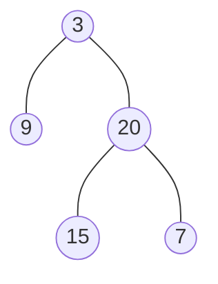
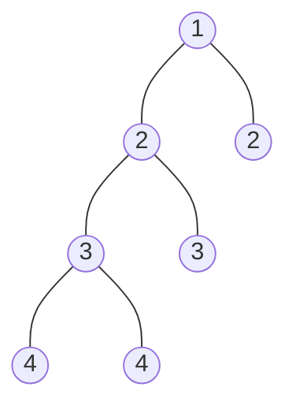

### [题目](https://leetcode-cn.com/problems/ping-heng-er-cha-shu-lcof/){:target="_blank"}

输入一棵二叉树的根节点，判断该树是不是平衡二叉树。如果某二叉树中任意节点的左右子树的深度相差不超过1，那么它就是一棵平衡二叉树。

示例 1:

给定二叉树 [3,9,20,null,null,15,7]



返回 true 。

示例 2:

给定二叉树 [1,2,2,3,3,null,null,4,4]



返回false 。


限制：  
0 <= 树的结点个数 <= 10000

**注意：** 本题与主站[110题](https://leetcode-cn.com/problems/balanced-binary-tree/){:target="_blank"}相同

### 题解

```java
public boolean isBalanced(TreeNode root) {
    // 递归获取树的最大深度
    Function<TreeNode, Integer> recursion = new Function<TreeNode, Integer>() {
        @Override
        public Integer apply(TreeNode node) {
            return node == null ? 0 : Math.max(this.apply(node.left), this.apply(node.right)) + 1;
        }
    };

    return root == null || (
        // 高度差不能超过1
        Math.abs(recursion.apply(root.left) - recursion.apply(root.right)) <= 1
            // 左右树也是高度平衡二叉树
            && this.isBalanced(root.left) && this.isBalanced(root.right)
    );
}
```