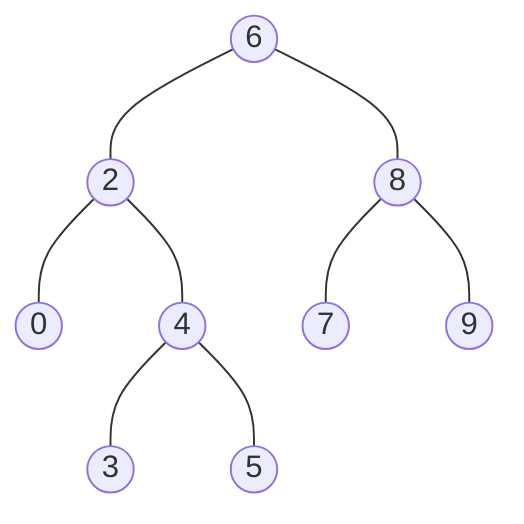

### [题目](https://leetcode-cn.com/problems/er-cha-sou-suo-shu-de-zui-jin-gong-gong-zu-xian-lcof/){:target="_blank"}

给定一个二叉搜索树, 找到该树中两个指定节点的最近公共祖先。

[百度百科](https://baike.baidu.com/item/%E6%9C%80%E8%BF%91%E5%85%AC%E5%85%B1%E7%A5%96%E5%85%88/8918834?fr=aladdin){:target="_blank"}中最近公共祖先的定义为：“对于有根树 T 的两个结点 p、q，最近公共祖先表示为一个结点 x，满足 x 是 p、q 的祖先且 x 的深度尽可能大（一个节点也可以是它自己的祖先）。”

例如，给定如下二叉搜索树: root =[6,2,8,0,4,7,9,null,null,3,5]



示例 1:  
输入: root = [6,2,8,0,4,7,9,null,null,3,5], p = 2, q = 8  
输出: 6  
解释: 节点 2 和节点 8 的最近公共祖先是 6。

示例 2:  
输入: root = [6,2,8,0,4,7,9,null,null,3,5], p = 2, q = 4  
输出: 2  
解释: 节点 2 和节点 4 的最近公共祖先是 2, 因为根据定义最近公共祖先节点可以为节点本身。

说明:  
- 所有节点的值都是唯一的。
- p、q 为不同节点且均存在于给定的二叉搜索树中。

注意：本题与主站[235题](https://leetcode-cn.com/problems/lowest-common-ancestor-of-a-binary-search-tree/){:target="_blank"}相同

### 题解

```java
public TreeNode lowestCommonAncestor(TreeNode root, TreeNode p, TreeNode q) {
    // p、q的值均大于根节点 说明在二叉搜索树右树
    if (p.val > root.val && q.val > root.val) {
        return this.lowestCommonAncestor(root.right, p, q);
    }

    // p、q的值均小于根节点 说明在二叉搜索树左树
    if (p.val < root.val && q.val < root.val) {
        return this.lowestCommonAncestor(root.left, p, q);
    }

    // 若一个大于根节点的值 一个小于根节点的值 说明两个节点分别在左右树 则根节点最近祖先
    // 若根节点的值与p、q其中一个相同 则根节点最近祖先
    return root;
}
```