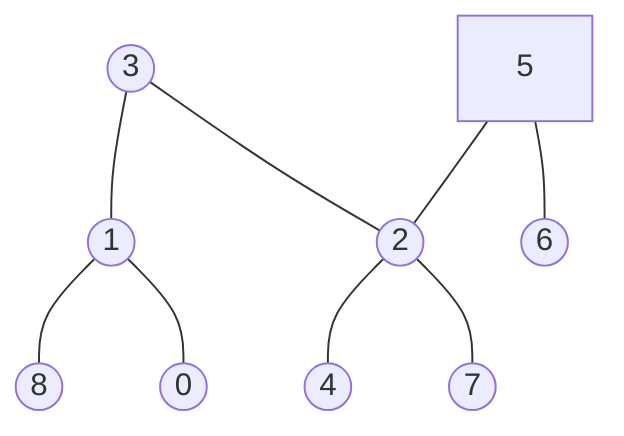

### [题目](https://leetcode-cn.com/problems/er-cha-shu-de-zui-jin-gong-gong-zu-xian-lcof/){:target="_blank"}

给定一个二叉树, 找到该树中两个指定节点的最近公共祖先。

[百度百科](https://baike.baidu.com/item/%E6%9C%80%E8%BF%91%E5%85%AC%E5%85%B1%E7%A5%96%E5%85%88/8918834?fr=aladdin){:target="_blank"}中最近公共祖先的定义为：“对于有根树 T 的两个结点 p、q，最近公共祖先表示为一个结点 x，
满足 x 是 p、q 的祖先且 x 的深度尽可能大（一个节点也可以是它自己的祖先）。”

例如，给定如下二叉树: root =[3,5,1,6,2,0,8,null,null,7,4]



示例 1:  
输入: root = [3,5,1,6,2,0,8,null,null,7,4], p = 5, q = 1  
输出: 3  
解释: 节点 5 和节点 1 的最近公共祖先是节点 3。

示例2:  
输入: root = [3,5,1,6,2,0,8,null,null,7,4], p = 5, q = 4  
输出: 5  
解释: 节点 5 和节点 4 的最近公共祖先是节点 5。因为根据定义最近公共祖先节点可以为节点本身。

说明:
- 所有节点的值都是唯一的。
- p、q 为不同节点且均存在于给定的二叉树中。

注意：本题与主站[236题](https://leetcode-cn.com/problems/lowest-common-ancestor-of-a-binary-tree/){:target="_blank"}相同

### 题解

```java
public TreeNode lowestCommonAncestor(TreeNode root, TreeNode p, TreeNode q) {
    if (root == p || root == q || root == null) {
        return root;
    }

    TreeNode left = this.lowestCommonAncestor(root.left, p, q);
    TreeNode right = this.lowestCommonAncestor(root.right, p, q);
    // 两个节点分别在左右树 则根节点是最近祖先
    if (left != null && right != null) {
        return root;
    }

    return left != null ? left : right;
}
```