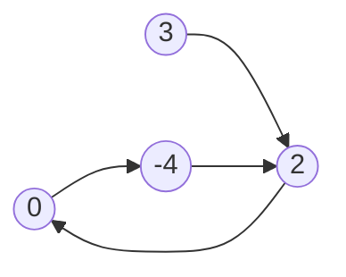
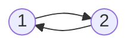

### [题目](https://leetcode-cn.com/problems/c32eOV/){:target="_blank"}

给定一个链表，返回链表开始入环的第一个节点。 从链表的头节点开始沿着 next 指针进入环的第一个节点为环的入口节点。
如果链表无环，则返回null。

为了表示给定链表中的环，我们使用整数 pos 来表示链表尾连接到链表中的位置（索引从 0 开始）。 如果 pos 是 -1，则在该链表中没有环。

**注意**，pos 仅仅是用于标识环的情况，并不会作为参数传递到函数中。

**说明：**不允许修改给定的链表。

**示例 1：**



输入：head = [3,2,0,-4], pos = 1  
输出：返回索引为 1 的链表节点  
解释：链表中有一个环，其尾部连接到第二个节点。

**示例2：**



输入：head = [1,2], pos = 0  
输出：返回索引为 0 的链表节点  
解释：链表中有一个环，其尾部连接到第一个节点。

**示例 3：**


输入：head = [1], pos = -1  
输出：返回 null  
解释：链表中没有环。

**提示：**
- 链表中节点的数目范围在范围 [0, 10<sup>4</sup>] 内
- -10<sup>5</sup> <= Node.val <= 10<sup>5</sup>
- pos 的值为 -1 或者链表中的一个有效索引

**进阶：**是否可以使用 O(1) 空间解决此题？

**注意：**本题与主站[142题](https://leetcode-cn.com/problems/linked-list-cycle-ii/){:target="_blank"}相同

### 题解

```java
public ListNode detectCycle(ListNode head) {
    // 若节点数少于1 则不能构成环
    // 严格的说1个节点也能构成环，只要头结点后置节点非空即可
    if (head == null || head.next == null) {
        return null;
    }

    // 快慢指针 慢指针每次移动一个节点，快指针每次移动两个节点
    ListNode slow = head, fast = head;
    // 若快指针为null 表名链表没有环
    while (fast != null && fast.next != null) {
        slow = slow.next;
        fast = fast.next.next;

        // 指针相遇表名链表有环，且相遇在环中某个位置 快指针会在超圈后与慢指针相遇
        if (slow == fast) {
            // 假设头结点到入环点距离是d 入环点到相遇点距离为s1 相遇点到入环点距离为s2
            // 那么快指针走的距离是 d + n * (s1 + s2) + s1
            // 慢指针走的距离是d + s1
            // 快指针走的距离是慢指针的2被 2(d + s1) = d + n * (s1 + s2) + s1 => d = (n-1)*(s1+s2) + s2
            // 可知相遇点到入环点距离s2和头结点到入环点距离d相同
            // 所以将任意指针指向头结点两个指针相遇即是入环点
            fast = head;
            while (slow != fast) {
                slow = slow.next;
                fast = fast.next;
            }

            return fast;
        }
    }

    return null;
}
```