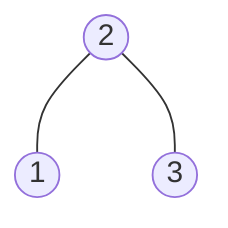
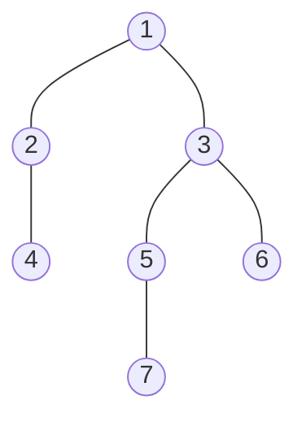

### [题目](https://leetcode-cn.com/problems/LwUNpT/){:target="_blank"}

给定一个二叉树的 根节点 root，请找出该二叉树的最底层最左边节点的值。

假设二叉树中至少有一个节点。

**示例 1:**



输入: root = [2,1,3]  
输出: 1

**示例 2:**



输入: [1,2,3,4,null,5,6,null,null,7]  
输出: 7

**提示：**
- 二叉树的节点个数的范围是 [1,10<sup>4</sup>]
- -2<sup>31</sup> <= Node.val <= 2<sup>31</sup> - 1

**注意：**本题与主站[513题](https://leetcode-cn.com/problems/find-bottom-left-tree-value/){:target="_blank"}相同

### 题解

```java
public int findBottomLeftValue(TreeNode root) {
    int result = 0;

    // 层序遍历队列
    Queue<TreeNode> queue = new ArrayDeque<>();
    queue.offer(root);

    int size;
    TreeNode t;
    while (!queue.isEmpty()) {
        size = queue.size();

        for (int i = 0; i < size; i++) {
            t = queue.poll();
            // 队列头为每层的最左侧元素
            if (i == 0) {
                result = t.val;
            }

            // 左右树入队
            if (Objects.nonNull(t.left)) {
                queue.offer(t.left);
            }
            if (Objects.nonNull(t.right)) {
                queue.offer(t.right);
            }
        }
    }

    return result;
}
```