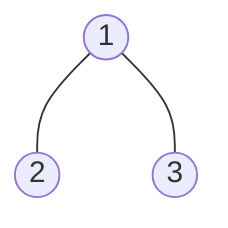
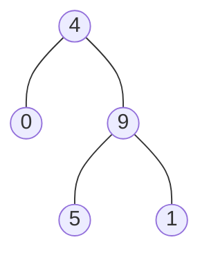

### [题目](https://leetcode-cn.com/problems/3Etpl5/){:target="_blank"}

给定一个二叉树的根节点 root ，树中每个节点都存放有一个 0 到 9 之间的数字。

每条从根节点到叶节点的路径都代表一个数字：

例如，从根节点到叶节点的路径 1 -> 2 -> 3 表示数字 123 。
计算从根节点到叶节点生成的 所有数字之和 。

叶节点 是指没有子节点的节点。

**示例 1：**



输入：root = [1,2,3]  
输出：25  
解释：  
从根到叶子节点路径 1->2 代表数字 12  
从根到叶子节点路径 1->3 代表数字 13  
因此，数字总和 = 12 + 13 = 25

**示例 2：**



输入：root = [4,9,0,5,1]  
输出：1026  
解释：  
从根到叶子节点路径 4->9->5 代表数字 495  
从根到叶子节点路径 4->9->1 代表数字 491  
从根到叶子节点路径 4->0 代表数字 40  
因此，数字总和 = 495 + 491 + 40 = 1026

**提示：**
- 树中节点的数目在范围 [1, 1000] 内
- 0 <= Node.val <= 9
- 树的深度不超过 10

**注意：**本题与主站[129题](https://leetcode-cn.com/problems/sum-root-to-leaf-numbers/){:target="_blank"}相同

### 题解

```java
public int sumNumbers(TreeNode root) {
    int[] result = new int[1];

    // 递归有顶到底的所有路径
    BiConsumer<Integer, TreeNode> recursion = new BiConsumer<Integer, TreeNode>() {
        @Override
        public void accept(Integer prefix, TreeNode node) {
            // 前缀和乘10加上当前节点值即为路径所代表的数字
            int p = prefix * 10 + node.val;
            // 保证递归路径节点不为空
            if (Objects.isNull(node.left) && Objects.isNull(node.right)) {
                result[0] += p;
                return;
            }

            if (Objects.nonNull(node.left)) {
                this.accept(p, node.left);
            }

            if (Objects.nonNull(node.right)) {
                this.accept(p, node.right);
            }
        }
    };

    // 根节点为空 和为0
    if (Objects.nonNull(root)) {
        recursion.accept(0, root);
    }

    return result[0];
}
```