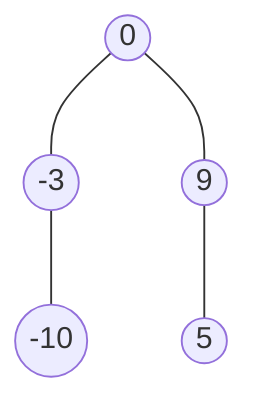

### [题目](https://leetcode-cn.com/minimum-height-tree-lcci/){:target="_blank"}

给定一个有序整数数组，元素各不相同且按升序排列，编写一个算法，创建一棵高度最小的二叉搜索树。

示例:  
给定有序数组: [-10,-3,0,5,9],  
一个可能的答案是：[0,-3,9,-10,null,5]，它可以表示下面这个高度平衡二叉搜索树：



### 题解

```java
public TreeNode sortedArrayToBST(int[] nums) {
    BiFunction<Integer, Integer, TreeNode> recursion = new BiFunction<Integer, Integer, TreeNode>() {
        @Override
        public TreeNode apply(Integer begin, Integer end) {
            if (begin > end) {
                return null;
            }
            // 取中间节点为根节点
            int mid = (begin + end) / 2;
            TreeNode node = new TreeNode(nums[mid]);
            // 递归生成左树
            node.left = this.apply(begin, mid - 1);
            // 递归生成右树
            node.right = this.apply(mid + 1, end);
            return node;
        }
    };

    return nums.length == 0 ? null : recursion.apply(0, nums.length - 1);
}
```