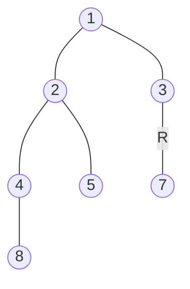

### [题目](https://leetcode-cn.com/list-of-depth-lcci/){:target="_blank"}

给定一棵二叉树，设计一个算法，创建含有某一深度上所有节点的链表（比如，若一棵树的深度为 D，则会创建出 D 个链表）。
返回一个包含所有深度的链表的数组。

示例：  
输入：[1,2,3,4,5,null,7,8]



输出：[[1],[2,3],[4,5,7],[8]]

### 题解

```java
public ListNode[] listOfDepth(TreeNode tree) {
    // 保存链表头结点
    List<ListNode> nodes = new ArrayList<>();
    // 保存游标
    List<ListNode> cursors = new ArrayList<>();

    // 递归遍历树
    BiConsumer<Integer, TreeNode> recursion = new BiConsumer<Integer, TreeNode>() {
        @Override
        public void accept(Integer depth, TreeNode node) {
            if (node == null) {
                return;
            }

            // 若是未遍历过的层级 添加头节点及游标
            ListNode child = new ListNode(node.val);
            if (nodes.size() < depth) {
                nodes.add(child);
                cursors.add(child);
            } else {
                // 已经遍历的层级 追加节点 移动游标
                cursors.get(depth - 1).next = child;
                cursors.set(depth - 1, child);
            }

            // 递归先遍历左树
            if (node.left != null) {
                this.accept(depth + 1, node.left);
            }

            // 递归后遍历右树
            if (node.right != null) {
                this.accept(depth + 1, node.right);
            }
        }
    };

    recursion.accept(1, tree);

    return nodes.toArray(new ListNode[0]);
}
```