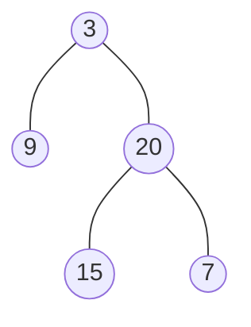
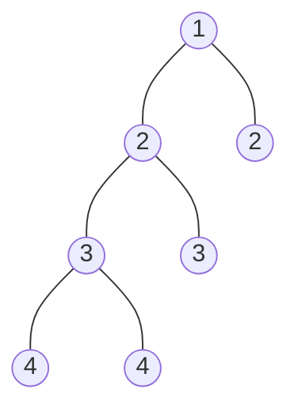

### [题目](https://leetcode-cn.com/check-balance-lcci/){:target="_blank"}

实现一个函数，检查二叉树是否平衡。在这个问题中，平衡树的定义如下：任意一个节点，其两棵子树的高度差不超过 1。

示例 1:  
给定二叉树 [3,9,20,null,null,15,7]



返回 true 。

示例 2:  
给定二叉树 [1,2,2,3,3,null,null,4,4]



返回false 。

### 题解

```java
public boolean isBalanced(TreeNode root) {
    Function<TreeNode, Integer> recursion = new Function<TreeNode, Integer>() {
        @Override
        public Integer apply(TreeNode node) {
            return node == null ? 0 : Math.max(this.apply(node.left), this.apply(node.right)) + 1;
        }
    };

    return root == null || (
        // 高度差不能超过1
        Math.abs(recursion.apply(root.left) - recursion.apply(root.right)) <= 1
            // 左右树也是高度平衡二叉树
            && this.isBalanced(root.left) && this.isBalanced(root.right)
    );
}
```