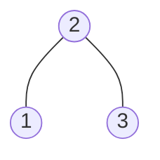
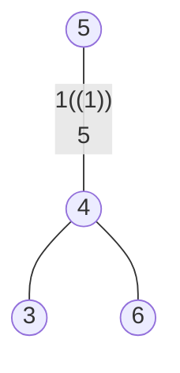

### [题目](https://leetcode-cn.com/legal-binary-search-tree-lcci/){:target="_blank"}

实现一个函数，检查一棵二叉树是否为二叉搜索树。

示例1:

输入:



输出: true

示例2:

输入:



输出: false

解释: 输入为: [5,1,4,null,null,3,6]。 根节点的值为 5 ，但是其右子节点值为 4 。

### 题解

```java
public boolean isValidBST(TreeNode root) {
    List<Integer> list = new ArrayList<>();
    // 中序遍历树
    Consumer<TreeNode> inorderTraversal = new Consumer<TreeNode>() {
        @Override
        public void accept(TreeNode node) {
            if (node == null) {
                return;
            }
            this.accept(node.left);
            list.add(node.val);
            this.accept(node.right);
        }
    };
    inorderTraversal.accept(root);

    // 若中序遍历结果是升序的 则是二叉搜索树 否则不是
    for (int i = 1, length = list.size(); i < length; i++) {
        if (list.get(i - 1) >= list.get(i)) {
            return false;
        }
    }

    return true;
}
```