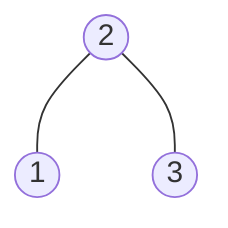
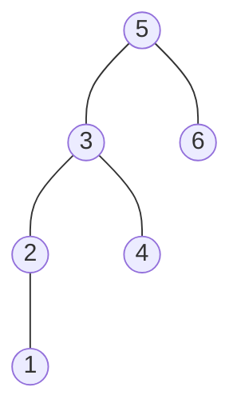

### [题目](https://leetcode-cn.com/successor-lcci/){:target="_blank"}

设计一个算法，找出二叉搜索树中指定节点的“下一个”节点（也即中序后继）。
如果指定节点没有对应的“下一个”节点，则返回null。

示例 1:

输入: root = [2,1,3], p = 1



输出: 2


示例 2:

输入: root = [5,3,6,2,4,null,null,1], p = 6



输出: null

### 题解

```java
public TreeNode inorderSuccessor(TreeNode root, TreeNode p) {
    if (root == null) {
        return null;
    }

    // 中序遍历
    TreeNode node = this.inorderSuccessor(root.left, p);
    // 若左树存在比p的值大的节点 直接返回
    if (node != null) {
        return node;
    }

    // 若根节点比p节点值大直接返回
    if (root.val > p.val) {
        return root;
    }

    // 否则遍历右树是否存在比p节点值大的节点
    return this.inorderSuccessor(root.right, p);
}
```