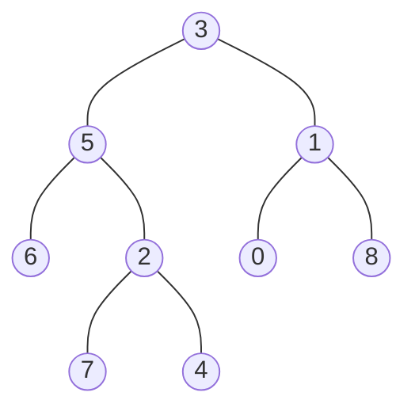

### [题目](https://leetcode-cn.com/first-common-ancestor-lcci/){:target="_blank"}

设计并实现一个算法，找出二叉树中某两个节点的第一个共同祖先。不得将其他的节点存储在另外的数据结构中。
注意：这不一定是二叉搜索树。

例如，给定如下二叉树: root = [3,5,1,6,2,0,8,null,null,7,4]



示例 1:  
输入: root = [3,5,1,6,2,0,8,null,null,7,4], p = 5, q = 1  
输出: 3  
解释: 节点 5 和节点 1 的最近公共祖先是节点 3。  

示例 2:  
输入: root = [3,5,1,6,2,0,8,null,null,7,4], p = 5, q = 4  
输出: 5  
解释: 节点 5 和节点 4 的最近公共祖先是节点 5。因为根据定义最近公共祖先节点可以为节点本身。

说明:
- 所有节点的值都是唯一的。
- p、q 为不同节点且均存在于给定的二叉树中。

### 题解

```java
public TreeNode lowestCommonAncestor(TreeNode root, TreeNode p, TreeNode q) {
    if (root == null) {
        return null;
    }

    // 若p、q其中一个节点为根节点 直接返回
    if (p == root || q == root) {
        return root;
    }

    // 递归分别查找p、q在左树还是右树
    TreeNode left = this.lowestCommonAncestor(root.left, p, q);
    TreeNode right = this.lowestCommonAncestor(root.right, p, q);
    // 若左树不存在共同祖先 则肯定存在于右树
    if (left == null) {
        return right;
    }

    // 同理 若右树不存在共同祖先 则肯定在左树
    if (right == null) {
        return left;
    }

    // 否则 p、q节点都在左右树存在 则表示当前根节点为最近祖先
    return root;
}
```