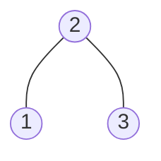

### [题目](https://leetcode-cn.com/bst-sequences-lcci/){:target="_blank"}

从左向右遍历一个数组，通过不断将其中的元素插入树中可以逐步地生成一棵二叉搜索树。
给定一个由不同节点组成的二叉搜索树，输出所有可能生成此树的数组。


示例：  
给定如下二叉树



返回：

```java
[
  [2,1,3],
  [2,3,1]
]
```

### 题解

```java
public List<List<Integer>> BSTSequences(TreeNode root) {
    if (root == null) {
        return new ArrayList<>(Collections.singleton(new ArrayList<>()));
    }

    List<List<Integer>> result = new ArrayList<>();

    BiConsumer<List<TreeNode>, Stack<Integer>> dfs = new BiConsumer<List<TreeNode>, Stack<Integer>>() {
        @Override
        public void accept(List<TreeNode> list, Stack<Integer> solution) {
            if (list.isEmpty()) {
                result.add(new ArrayList<>(solution));
                return;
            }

            for (int i = 0; i < list.size(); i++) {
                List<TreeNode> next = new ArrayList<>(list);
                TreeNode node = next.remove(i);
                solution.push(node.val);
                // 添加左右节点
                Optional.ofNullable(node.left).ifPresent(next::add);
                Optional.ofNullable(node.right).ifPresent(next::add);
                // dfs
                this.accept(next, solution);
                // 回溯
                solution.pop();
            }
        }
    };

    dfs.accept(new ArrayList<>(Collections.singletonList(root)), new Stack<>());

    return result;
}
```