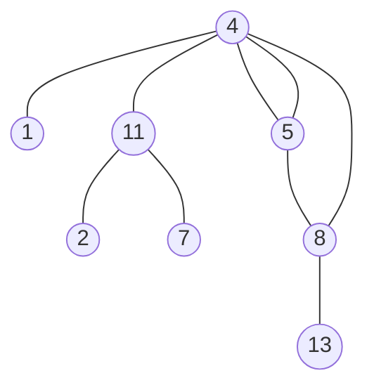

### [题目](https://leetcode-cn.com/paths-with-sum-lcci/){:target="_blank"}

给定一棵二叉树，其中每个节点都含有一个整数数值(该值或正或负)。设计一个算法，
打印节点数值总和等于某个给定值的所有路径的数量。注意，路径不一定非得从二叉树的根节点或叶节点开始或结束，
但是其方向必须向下(只能从父节点指向子节点方向)。

示例:  
给定如下二叉树，以及目标和sum = 22，



返回: 3  
解释：和为 22的路径有：[5,4,11,2], [5,8,4,5], [4,11,7]

提示：  
节点总数 <= 10000

### 题解

```java
public int pathSum(TreeNode root, int sum) {
    // 获取树的最大深度
    Function<TreeNode, Integer> levelRecursion = new Function<TreeNode, Integer>() {
        @Override
        public Integer apply(TreeNode node) {
            return node == null ? 0 : 1 + Math.max(this.apply(node.left), this.apply(node.right));
        }
    };

    // 深度
    int level = levelRecursion.apply(root);
    // 缓存没次遍历每层的数字
    int[] values = new int[level];
    // 结果
    AtomicInteger result = new AtomicInteger();

    BiConsumer<TreeNode, Integer> dfs = new BiConsumer<TreeNode, Integer>() {
        @Override
        public void accept(TreeNode node, Integer lvl) {
            if (node == null) {
                return;
            }

            // 缓存当前层的数字
            values[lvl] = node.val;

            int summary = 0;
            // 由下到上求解
            for (int i = lvl; i >= 0; i--) {
                if (sum == (summary += values[i])) {
                    result.incrementAndGet();
                }
            }
            // 继续遍历
            this.accept(node.left, lvl + 1);
            this.accept(node.right, lvl + 1);
        }
    };
    dfs.accept(root, 0);

    return result.get();
}
```